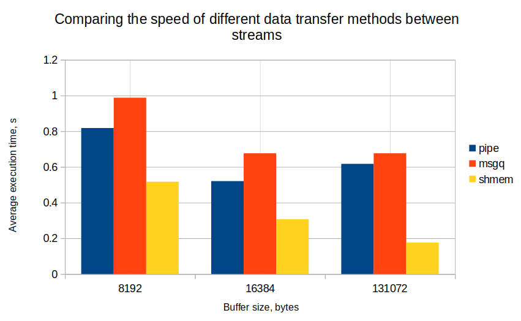

# Terminal emulator
Computer technologies, task 3, file sharing speed comparison.

There are three methods for comparison:
* Using pipe
* Using message queues
* Using shared memory

All names of temporary files specified in [config/config.h](./config/config.h). To check if the file was shared correctly just compare "fifo_rcvd","msgq_rcvd" and "smem_rcvd" files with source file. All temporary files are removed by program. RCVD (recieved) files are not temporary but every time the program shares files it rewrites the files.

## Author
Усолцьев Иван Алексеевич, студент 2-го гурса ФРКТ МФТИ, группа Б01-307.

## Usage
To build the project go to [UsoltsevI/task3/](UsoltsevI/task3/) folder and run the following command:
```
cmake -DCMAKE_BUILD_TYPE=Release -S . -B build
VERBOSE=1 cmake --build ./build
```

Usage example:
```
./build/filesharing <file_name>
./build/filesharing onegb
```

## Test results
The measurements were taken on my laptop. 

In these places, a 1 GB file was transferred from child to parent in various ways. The operation is repeated 10 times in a cycle and its average value is output.

The maximum size of the message queue buffer is 8192 bytes. The pipe size is four pages, 16384 bytes.



The fastest way is to transfer data using shared memory. This is the fastest way because threads can work with data at the same time. The allocated shared memory was divided into 4 parts, each of which is equal to the size of the buffer.
The method using pipe showed the greatest effectiveness at 16384 bytes - that is, on a buffer equal to its size.
The slowest method is using message queues.
