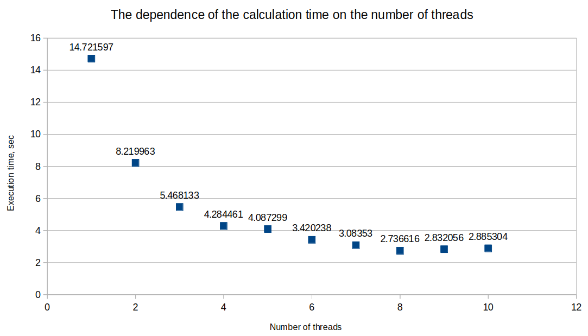

# Terminal emulator
Computer technologies, task 4, parallel computation by the Monte Carlo algorithm.

## Author
Усолцьев Иван Алексеевич, студент 2-го гурса ФРКТ МФТИ, группа Б01-307.

## Usage
To build the project go to [UsoltsevI/task4/](UsoltsevI/task4/) folder and run the following command:
```
cmake -DCMAKE_BUILD_TYPE=Release -S . -B build
VERBOSE=1 cmake --build ./build
```

Usage example:
```
./build/filesharing <num_threads> <num_points> <math_munc>
./build/filesharing 4 10000 cos
```

## Test results

The tests were conducted on my laptop on the x2 function and 1_000_000_000 points. According to the documentation, my laptop has 8 cores. Observations via htop have shown that running cores are loaded at 100%.



The diagram shows that the time is almost inversely proportional to the number of cores. Not perfect compliance with the 1/x schedule is due to the fact that some of the resources are spent before and after the separation of streams, as well as on the separation of streams.

The shortest execution time is on 8 cores. This number is equal to the number of cores of my processor.
As you can see, after 8 the chart starts to rise slightly. Then it goes into a straight line, which is at about 2.88sec. This value was exactly repeated for all num_threads going after 10 (11, 12, 34).
