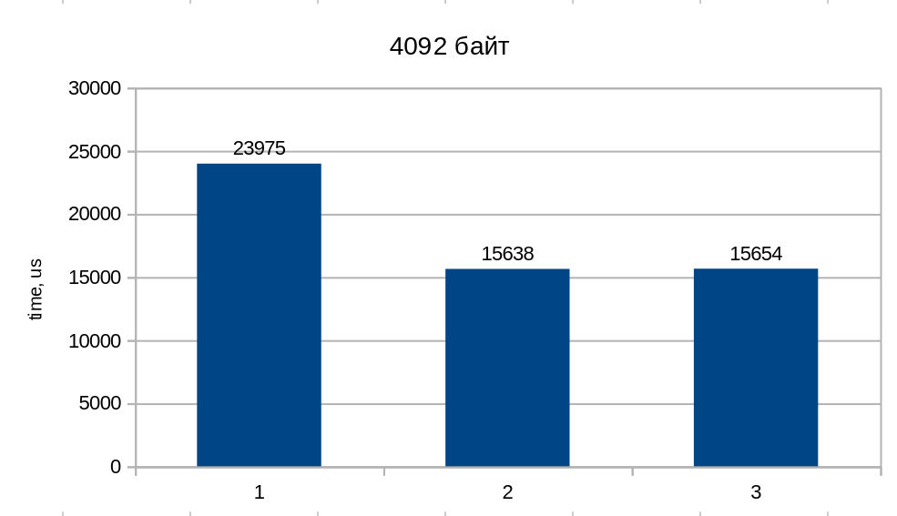
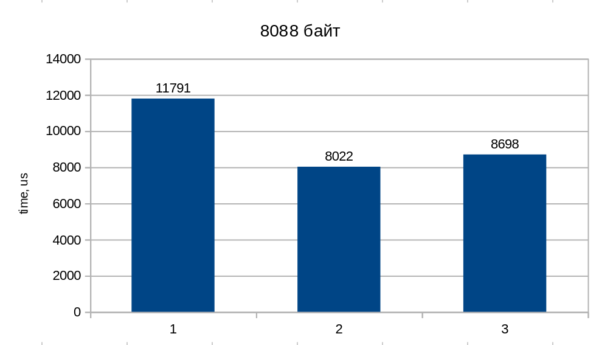
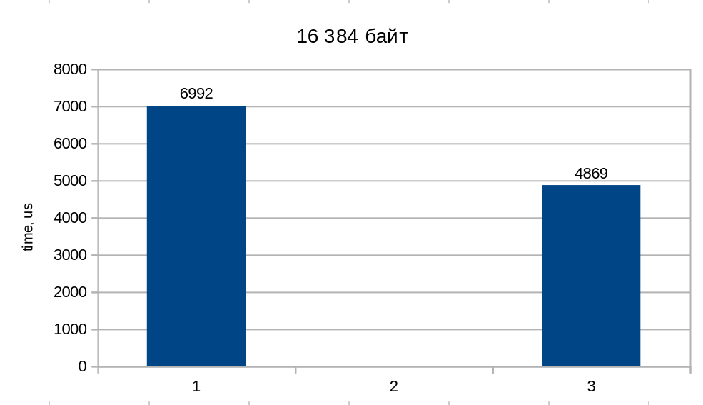
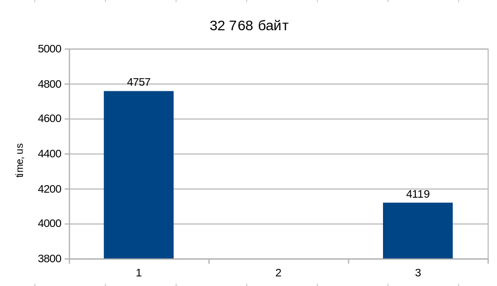

## Замерение времени работы IPC в зависимости от размера буфера

Весь необходимый код написан. Получились 3 очень похожие друг на друга программы, использующие разные средства межпроцессовой связи. Измерим время работы разных IPC в зависимости от размера буффера, который эти IPC будут иметь. Для теста использовался большой файл размером 5Гб, целостность файла проверялась через `md5sum`, Результаты будут приведены в виде диаграммы,
где:

#### 1 - связь через разделяемую память
#### 2 - связь через очереди сообщений
#### 3 - связь через именованные каналы

### 1) Буффер размером 1Кб

 

### 1) Буффер размером 4Кб

 

### 1) Буффер размером 8Кб

 

Дальше очереди сообщений отказываются принимать буфер размером более 8 килобайт, поэтому статистика приведена только для объединённой памяти и именнованных каналов:

### 1) Буффер размером 16Кб

 

### 1) Буффер размером 32Кб

 

Таким образом, можем сделать вывод: дольше всех работает разделяемая память(из-за необходимости использовать средства синхронизации), затем при маленьких размерах буфера быстрее всех оказывается передача данных на именованных канал, а при размерах буфера больших 4кб по скорости лидируют очереди сообщений, хотя при размере буфера больше 8кб очереди сообщений работать не могут или не хотят. При очень больших размерах буферов разница между именованными каналами и разделяемой памятью становиться менее заметной
(меньше циклов - меньше времени на синхронизацию)