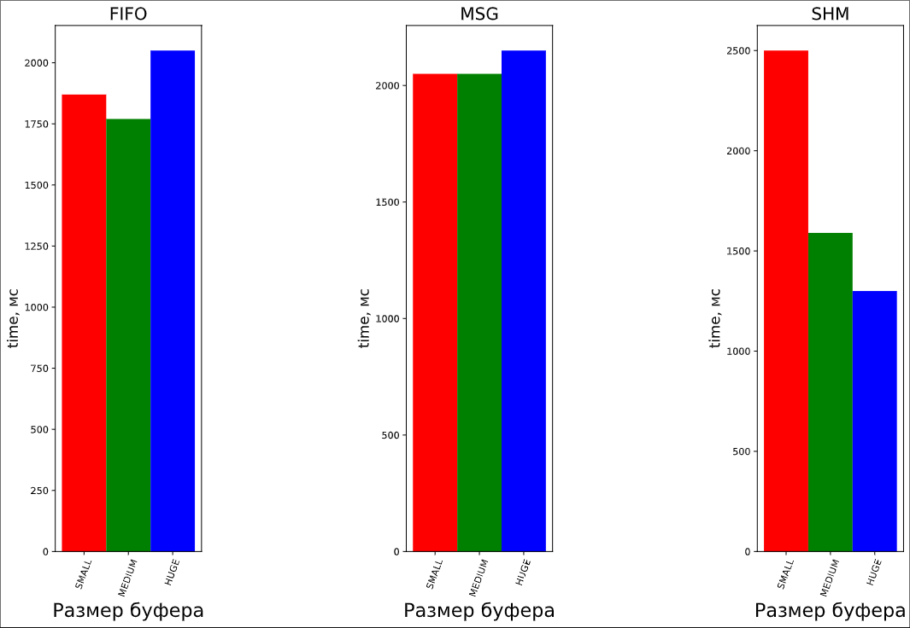

# Исследование времени передачи файлов через разные примитивы IPC

Данные программы выполняют пересылку файла размером в `4 GB` через один из `трёх` примитивов IPC. При этом используются 3 разных размера промежуточного буфера.  

## Примитивы IPC
+ **FIFO**
+ **Очередь сообщений msg**
+ **Shared memory**

## Размеры промежуточного буфера
+ 8192 байт (8 KB)
+ 65536 (65 KB)
+ 1048576 (1 MB)

## Измерения

Измерения будем производить с использованием функции `clock()` из библиотеки `time`. Установим константу CLOCKS_PER_SEC == 1000, 
следовательно мы получим измерения в миллисекундах. Чем меньше цифру мы получим, тем быстрее работает примитив IPC. Счётчик повесим на 
процесс, принимающий данные.

## Результаты

Время указано в `мс`

|<!-- -->| FIFO |  MSG | SHM  |
|:------:|:----:|:----:|:----:|
| SMALL  | 1870 | 2050 | 2500 | 
| MEDIUM | 1770 | 2050 | 1590 |  
| HUGE   | 2050 | 2150 | 1300 |  

## Объяснение результатов

1. Как можно заметить, в случае с `FIFO` максимальная скорость достигается при размере буфера примерно равному размеру `FIFO`. В случае с малым буфером мы делаем слишком много системных вызовов `write` чтобы записать один и тот же объём данных. А в случае с большим буфером вызов `write` слишком часто виснет на заполненном буфере, отвисая только тогда, когда планировщик поставит процесс чтения и он вычитает что-то из `FIFO`

2. Максимальный размер очереди сообщений равен `8KB` на моей системе, что соответствует малому размеру буфера, поэтому оптимальная скорость достигается при буфере размером `8KB`. Во всех остальных случаях скорость будет ниже, потому что появляются накладные расходы на копирования из буфера в структуру сообщения.

3. В случае с общей памятью, максимальная скорость достигается при максимальном размере общей памяти, при малом размере программа очень много времени теряет на синхронизации на семафорах, потому что работа с семафорами построена на системных вызовах, и наоборот при максимальном размере памяти, скорость возрастает, а количество синхронизаций уменьшается.

## Вывод

При организации межпроцессного взаимодействия при передаче малых объёмов данных лучше всего использовать FIFO или очереди сообщений(если не учитывать специфику их работы и рассматривать только как способ передачи данных), но а в случае больших данных стоит использовать общую память с синхронизацией.