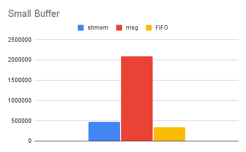
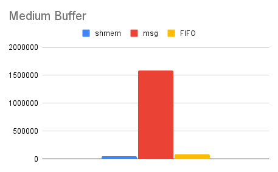
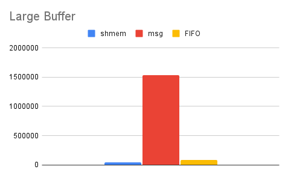

# Исследование трех видов передачи данных

В процессе исследования эффективности передачи данных между процессами с использованием трех различных механизмов синхронизации (общая память, именованный канал FIFO и очередь сообщений) было установлено следующее:

## Small Buffer (2048)

  
   
  <em>Small Buffer</em>

*Размер буфера примерно равен максимальному размеру сообщения для очереди сообщений.*

- **Именованный канал (FIFO)** продемонстрировал наибольшую производительность среди исследованных механизмов передачи данных. Это связано с тем, что при небольшом размере буфера **FIFO** использует буферизацию операционной системы, что минимизирует накладные расходы на синхронизацию между процессами и позволяет быстрее передавать данные.
- **Общая память (shmem)** показала результаты немного хуже, чем **FIFO**. Несмотря на то, что доступ к данным происходит напрямую, дополнительные затраты на синхронизацию и обеспечение согласованности данных при небольшом размере буфера приводят к некоторому снижению скорости.
- **Очередь сообщений (msg)** оказалась значительно медленнее (в 4 раза), поскольку каждое сообщение требует дополнительных системных вызовов для копирования данных между процессами и управления очередью. Это приводит к значительным накладным расходам при большом количестве небольших сообщений.

## Medium Buffer (65536)

  
   
  <em>Medium Buffer</em>

*Размер буфера порядка размера буфера FIFO*

- При таком размере буфера **именованный канал (FIFO)** продолжает демонстрировать наилучшую производительность. Каналы **FIFO** эффективно работают с буферами, близкими к собственному максимальному размеру, что позволяет минимизировать количество обращений к системе ввода-вывода и сохранять высокую скорость передачи данных.

- **Общая память (shmem)** показывает схожие результаты, но незначительно уступает **FIFO** из-за дополнительных затрат на управление разделяемыми ресурсами, необходимых для предотвращения конфликтов при доступе.

- **Очередь сообщений (msg)** вновь демонстрирует отставание. Для каждого среднего сообщения по-прежнему требуются затраты на системные вызовы и копирование данных, что увеличивает время передачи данных в сравнении с **FIFO и общей памятью**.

## Large Buffer (1048576)

  
   
  <em>Large Buffer</em>

*Размер буффера существенно больше 4 Кб.*

- При увеличении размера буфера разница в производительности стала еще более заметной. **FIFO** продолжает показывать наилучшие результаты, так как именованные каналы эффективно передают большие блоки данных, минимизируя накладные расходы на синхронизацию.

- В случае с **общей памятью (shmem)** наблюдается снижение производительности по сравнению с **FIFO**, поскольку при увеличении объема данных возникают дополнительные затраты на обеспечение согласованности данных и синхронизацию доступа.

- **Очередь сообщений (msg)** демонстрирует резкое падение производительности при передаче больших объемов данных. Это связано с тем, что каждый крупный блок данных требует большего количества системных вызовов и дополнительного копирования между процессами, что существенно замедляет передачу.

## Вывод

Таким образом, на основании полученных результатов можно сделать вывод, что именованные каналы (FIFO) являются наиболее эффективным механизмом передачи данных при использовании как небольших, так и средних и больших объемов данных, благодаря минимальным накладным расходам на синхронизацию и эффективному использованию буферизации операционной системы.
