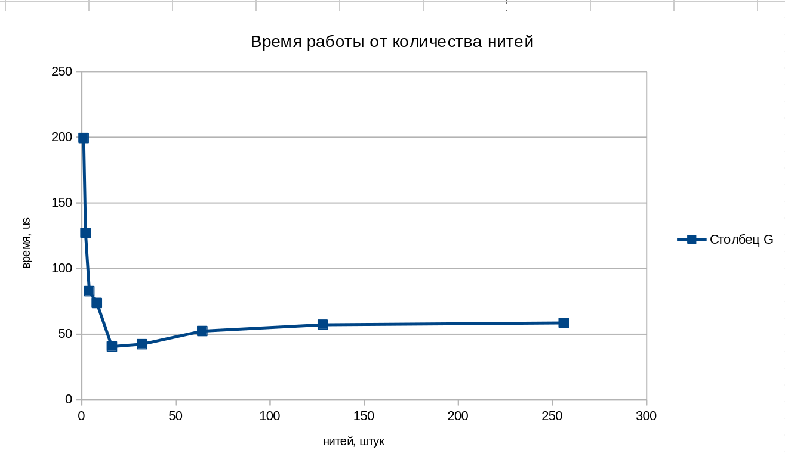

## Зависимость скорости выполнения программы от количества нитей исполнения в ней

Мы написали программу для вычисления интеграла методом Монте-Карло.
Многопоточность реализована без средств синхронизации на разделенных ячейках разделяемой памяти(для обработки результатов)

Приведем зависимость скорости работы программы в зависимости от количества потоков

Тесты выполнялись на 8-ми ядерном 16-ти поточном `Ryzen 7 7840HS`

Основная функция - квадратное уравнение

Количество точек - `10000128`

Измерив результаты от 1-ой нити до 256, получаем:

 

Как мы видим из графика, разделение на нити позволяет сократить время работы программы вплоть до 4 раз, до тех пор, пока мы используем физические нити. Как только мы количество нитей превосходит количество физических нитей, скорость работы упирается в потолок и начинает лишь падать.