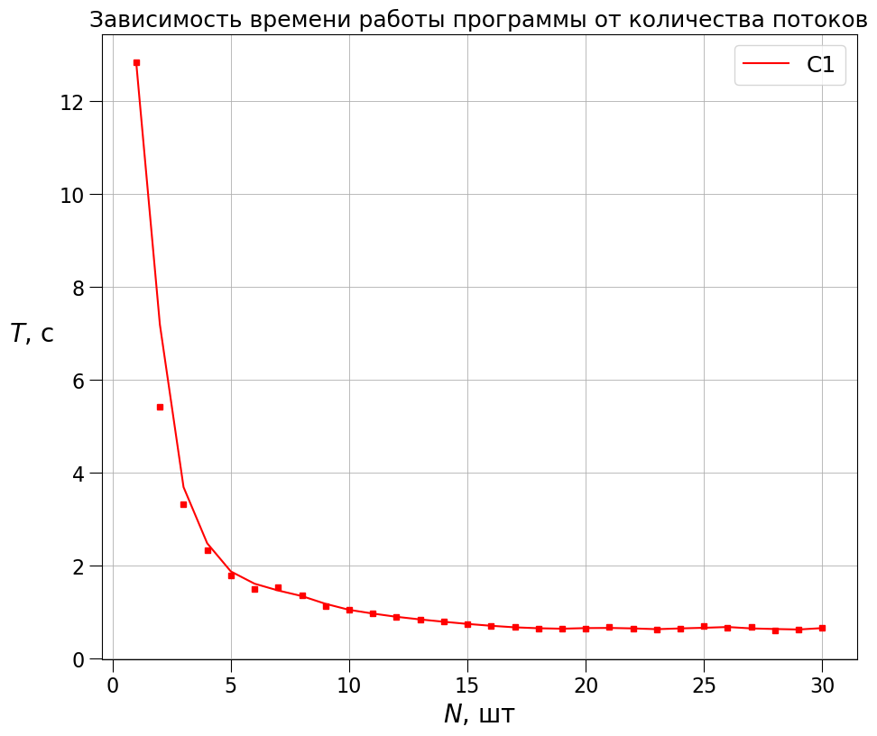

# Изучение влияния количества потоков на производительность программы

Программа занимается вычислением интеграла функции $y = x^2$ методом Монте-Карло.
Количество точек для вычисления одного интеграла: 1000000000.

Также экспериментально определим количество физических ядер процессора.

## Измерения и результаты

Проведём зависимость времени работы программы от количества потоков в ней

Будем увеличивать количество потоков до того момента, пока время работы программы не станет достоверно больше, чем при 20 потоках.

У меня это число составило `12000` потоков.

## Вывод

Как можно заметить по графику зависимости времени исполнения программы от количества потоков, с ростом числа потоков время исполнения понижается до какого-то предела. Предел наступает, когда количество потоков достигает количества физических ядер процессора. Из графика видно, что это число `от 18 до 20`. Реальное же число ядер в моём процессоре - `20`. Следовательно эксперимент был проведен корректно.
Также после увеличения числа потоков до `12000` скорость работы программы снизилась, что свидетельствует об увеличившемся вкладом в производительность времени н переключения потоков.